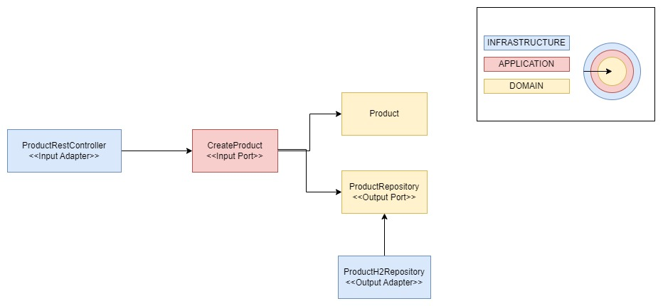

# Arquitectura Hexagonal

La arquitectura hexagonal, también conocida como Arquitectura de Puertos y Adaptadores, es un patrón de diseño de software cuyo objetivo principal es aislar el núcleo de la aplicación de las dependencias externas, como bases de datos, interfaces de usuario o servicios externos. Fue propuesta por Alistair Cockburn en 2005.

## Características:

* **Núcleo central:** El núcleo de la aplicación contiene la lógica de negocio y se mantiene independiente de las dependencias externas.

* **Puertos:** Son interfaces que definen cómo el sistema interactúa con el mundo exterior. Estos puertos pueden ser de entrada (para recibir datos) o de salida (para enviar datos).

* **Adaptadores:** Conectan los puertos a las tecnologías externas. Los adaptadores traducen las interacciones del sistema hacia las interfaces definidas por los puertos, y viceversa.

* **Aislamiento de dependencias:** Las dependencias externas no afectan al núcleo de la aplicación, lo que facilita el mantenimiento y la escalabilidad.

## Ventajas:

* **Desacoplamiento**: El sistema está menos acoplado a tecnologías o frameworks específicos, lo que facilita la sustitución de componentes y la adaptabilidad a nuevos requerimientos.

* **Facilidad de pruebas:** Al tener el núcleo aislado, las pruebas pueden centrarse en la lógica de negocio sin la necesidad de interactuar con bases de datos o interfaces externas.

* **Flexibilidad:** Permite integrar diferentes tecnologías o servicios externos sin afectar el comportamiento central de la aplicación.

* **Escalabilidad:** Es más fácil agregar nuevas funcionalidades sin alterar el sistema central.

## Desventajas:

* **Complejidad:** La estructura y la gestión de puertos y adaptadores puede agregar una capa adicional de complejidad al diseño de la aplicación, especialmente en sistemas pequeños.

* **Curva de aprendizaje:** Los desarrolladores pueden necesitar tiempo para familiarizarse con el patrón y comprender cómo implementarlo correctamente.

* **Sobrecarga de código:** En algunos casos, los adaptadores y puertos pueden generar una cantidad extra de código, especialmente en aplicaciones simples, lo que podría considerarse innecesario.

## Caso práctico

Claves:

* Como obliga a encapsular la lógica en la aplicación, podemos reemplazar o añadir nuevos adaptares sin problemas.
* 
* Como el dominio no tiene dependencia con librerias externas ni integraciones (clientes rest, base de datos, etc) es fácil implementar test unitarios.

## Enlaces interes

* https://github.com/martinachov

* https://alistair.cockburn.us/hexagonal-architecture/